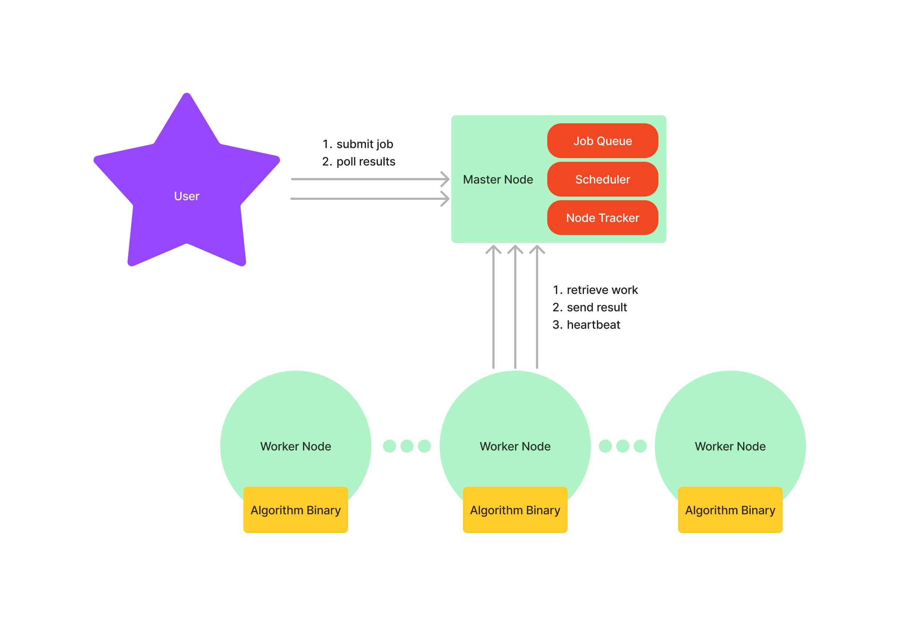

# Alignment@Home

Alignment@Home is a distributed system for distributed local [sequence alignment](https://en.wikipedia.org/wiki/Sequence_alignment).

It was developed as a lab project for the 2023/2024 Distributed Systems course at the Vrije Universiteit Amsterdam.

The key idea of the project is to enable crowdsourced local sequence alignment. This allows heterogeneous computers of any size (e.g., a laptop or a compute cluster node) to work together to perform sequence alignment jobs for scientists (this is a similar idea to [Folding@Home](https://en.wikipedia.org/wiki/Folding@home)).

## Overview
The project consists of two main aspects, 1) an implementation of the [Smith-Waterman algorithm](https://en.wikipedia.org/wiki/Smith%E2%80%93Waterman_algorithm), and 2) a [coordinator-worker architecture](https://en.wikipedia.org/wiki/Master%E2%80%93slave_(technology)) that is able to "intelligently" schedule and distribute the sequence alignment jobs across the pool of workers. The heterogeneous workers individually run a compute capacity estimation benchmark (using synthetic sequences), which is communicated to and used by the scheduler to distribute the work.

The diagram below depicts the coordinator-worker architecture. The project requires 1 master node, and 1+ worker nodes to be spun up (see instructions below). A command-line tool (see [CLI](#cli) below) can be used by the "User" (i.e., scientists) to submit sequence alignment jobs to the master node. The master will subsequently schedule and distribute the work across the pool of worker nodes, returning the result to the user when the work is finished.

For more details check out the project report.

## Prerequisites
The project uses Python, Golang, and (nightly) Rust.

We've used the following versions in our testing. Nightly rust is currently being used for the [std::simd](https://doc.rust-lang.org/nightly/std/simd/index.html) module. Once the module is stabilized then stable rust can be used.

| Dependency | Version                                     |
|------------|---------------------------------------------|
| Python     | 3.11.5                                      |
| poetry     | 1.7.1                                       |
| Go         | go1.21.4 linux/amd64                        |
| rustc      | rustc 1.76.0-nightly (eeff92ad3 2023-12-13) |
| cargo      | cargo 1.76.0-nightly (1aa9df1a5 2023-12-12) |

Python dependencies are managed by [Poetry](https://python-poetry.org/) ([installation instructions](https://python-poetry.org/docs/#installation)). After installing Poetry, you can install the project's dependencies from the root folder using `poetry install`.

Note: Specific instructions for running this project on the DAS5 compute cluster can be found [here](DAS5.md).

## Master

### Usage

Execute `poetry run python3 master/run.py` to start the master node (see [here](https://python-poetry.org/docs/basic-usage/#activating-the-virtual-environment) for more details about poetry and virtual environments).

Optionally, navigate to `http://localhost:8000/docs` for the API documentation.

### Testing

Run `poetry run pytest master` inside the root directory.

## Worker

### Usage

Execute `go run cmd/worker/main.go "0.0.0.0:8000"` to start the worker node. Golang should automatically install the required dependencies.

If the "master node IP and port" argument is not supplied, then the worker will connect to a default master node hosted locally at `0.0.0.0:8000`.

### Testing

Run `go test ./...` inside the root directory.

### Inner Workings
The worker runs in an infinite loop, which tries to register with the master node every X seconds. If the registration is successful, the worker starts sending a pulse to show the master it is alive every Y seconds, the worker also enters another loop state in which it asks for work every Z seconds. If it receives work from the master, it iterates through every query-target pair it was tasked to calculate and performs the Smith-Waterman algorithm. After it calculates the result of each pair, the worker immediately sends the result to the master such that if the worker were to shut down in the midst of calculations, the rest of the work could be delegated to another worker.

## CLI

A command-line tool has been developed that allows one to submit sequence alignment jobs.

Run `poetry run python3 tui [params]` to submit a job. Run it without any parameters for help.

An example use could be: `poetry run python3 tui --query datasets/query_sequences.fasta --database datasets/target_sequences.fasta --server-url http://0.0.0.0:8000 --match-score 2 --mismatch-penalty 1 --gap-penalty 1 --top-k 5`

The result of the alignments will be saved to the `results` directory, where for every query sequence, a file is generated, with the corresponding best result for every target in the database file, with the same id as in the original files.

## Synthetic Dataset Generation
You can use the [generate_synthetic_dataset.py](utils/generate_synthetic_data.py) script to generate a query and a database file to use for a test query.
